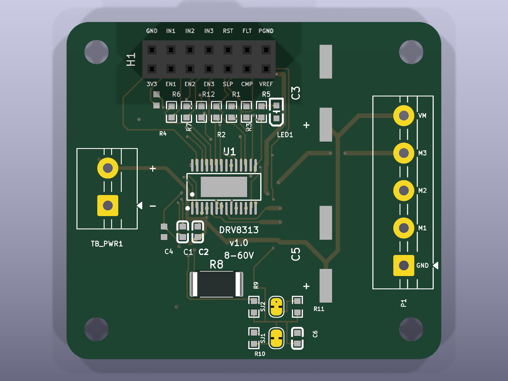
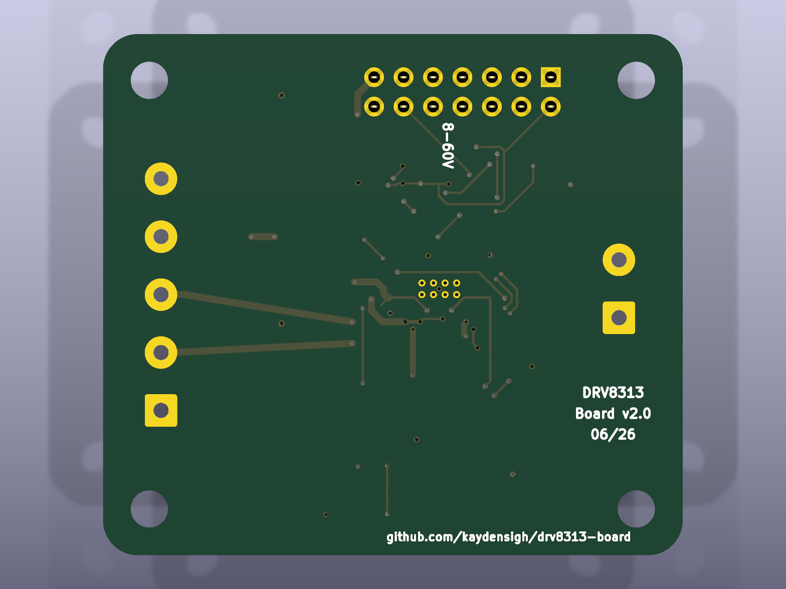
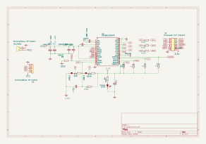
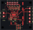

# DRV8313 Board

An open-hardware **3-phase motor driver module** built around the Texas Instruments
[**DRV8313**](https://www.ti.com/lit/ds/symlink/drv8313.pdf) (three half-bridges, 8–60 V).
It drives BLDC/PMSM motors (3-PWM / FOC, e.g. with [SimpleFOC](https://simplefoc.com)),
and — because the three half-bridges and their enables are broken out independently —
also brushed-DC motors, solenoids, and 6-step/trapezoidal loads.

 

> Derived from the [SimpleFOCMini](https://github.com/simplefoc/SimpleFOCMini) board
> ([EasyEDA source](https://easyeda.com/the.skuric/simplefocmini)) and re-engineered for
> the DRV8313's full voltage range. It has since diverged substantially from the original
> (higher voltage, larger 4-layer board, on-board current limit, independent half-bridge
> enables), hence the separate project.

## Specifications

| | |
| --- | --- |
| Driver | DRV8313PWPR (HTSSOP-28, exposed thermal pad) |
| Supply voltage | **8–60 V** |
| Continuous current | **~1.5 A / phase** (1 oz copper, Tj ≤ 125 °C; ~2 A with airflow). The datasheet's 2.5 A/phase is a *peak* rating. |
| Logic level | 3.3 V (DRV8313 on-chip `V3P3OUT` regulator; no separate LDO) |
| Board | **50 × 50 mm**, 4-layer (Top / GND / GND / Bottom, 1 oz) |
| Control | 3× IN (PWM) + 3× independent EN; nRESET / nSLEEP / nFAULT |
| Current limit | On-board comparator, cycle-by-cycle (50 mΩ shunt + reference divider) |
| Connectors | 2×7 control header, 5-pos motor/VM terminal block, 2-pos power terminal block |

### Features beyond the original SimpleFOCMini

- **8–60 V** input (vs. 8–24 V) on a 4-layer board with inner ground planes.
- **On-board over-current limit** using the DRV8313's internal comparator (`COMPP`/`COMPN`):
  a 50 mΩ low-side shunt and a 3.3 V reference divider, with two solder jumpers to set the
  trip point — both intact ≈ 2.5 A, cut `SJ1` ≈ 1.5 A, cut `SJ2` disables the limit. The
  comparator output (`nCOMPO`) is brought out on the header.
- **Independent half-bridge enables** (`EN1`/`EN2`/`EN3` on their own series resistors) so the
  board can run brushed-DC / solenoid / 6-step loads. Tie them together at the header to get
  the original ganged 3-PWM/FOC enable.

## Renders

| Schematic | PCB (top) | PCB (bottom) |
| --- | --- | --- |
|  |  |  |

## Repository layout

| Path | Contents |
| --- | --- |
| [`KiCad/project/`](./KiCad/project/) | KiCad 10 source — schematic, PCB, project, and the `drv8313-board.pretty` footprint library |
| [`manufacturing/`](./manufacturing/) | Fabrication outputs: [`gerbers/`](./manufacturing/gerbers/) (Gerber + Excellon drill), [BOM](./manufacturing/drv8313-board-BOM.csv), [pick-and-place CPL](./manufacturing/drv8313-board-CPL.csv), and a [STEP](./manufacturing/drv8313-board.step) 3D model |
| [`docs/`](./docs/) | [`datasheets/`](./docs/datasheets/) — the DRV8313 datasheet (authoritative part reference) |
| [`tools/`](./tools/) | Headless helper scripts — JLCPCB part search, manufacturing-file regeneration, silk version bump ([`tools/README.md`](./tools/README.md)) |
| [`images/`](./images/) | Renders used above |

The design is maintained **only** in KiCad now; the original Altium / EasyEDA / PDF exports
have been removed. The manufacturing files are regenerated from the KiCad project with
[`tools/build_manufacturing.py`](./tools/build_manufacturing.py) (a `kicad-cli` wrapper).

## Bill of materials

The full BOM (with footprints) is [`manufacturing/drv8313-board-BOM.csv`](./manufacturing/drv8313-board-BOM.csv).
Each MPN below links to its LCSC product page; **Library** is the JLCPCB part class —
**Basic** and **Preferred** are fee-free, **Extended** parts each add a one-time setup fee.

| Designator | Value | Qty | MPN | Unit price | Library |
| --- | --- | --- | --- | --- | --- |
| C1 | 10nF 100V | 1 | [CL10B103KC8NNNC](https://www.lcsc.com/product-detail/multilayer-ceramic-capacitors-mlcc-smd-smt_samsung-electro-mechanics-cl10b103kc8nnnc_C84709.html) | $0.0096 | Extended |
| C2 | 100nF | 1 | [CC0603KRX7R9BB104](https://www.lcsc.com/product-detail/multilayer-ceramic-capacitors-mlcc-smd-smt_yageo-cc0603krx7r9bb104_C14663.html) | $0.0108 | Basic |
| C3,C5 | 47uF 100V | 2 | [RVT2A470M1010](https://www.lcsc.com/product-detail/aluminum-electrolytic-capacitors-smd_honor-elec-rvt2a470m1010_C87862.html) | $0.1042 | Extended |
| C4,C6 | 470nF | 2 | [CL10B474KA8NNNC](https://www.lcsc.com/product-detail/multilayer-ceramic-capacitors-mlcc-smd-smt_samsung-electro-mechanics-cl10b474ka8nnnc_C1623.html) | $0.0088 | Basic |
| C7,C8 | 100nF 100V | 2 | [CL10B104KC8NNNC](https://www.lcsc.com/product-detail/multilayer-ceramic-capacitors-mlcc-smd-smt_samsung-electro-mechanics-cl10b104kc8nnnc_C15725.html) | $0.0219 | Extended |
| H1 | PinHeader 2x7 2.54mm | 1 | [2.54-2\*7P Female](https://www.lcsc.com/product-detail/female-headers_boomele-boom-precision-elec-2-54-2-7p_C38844.html) | $0.1097 | Extended |
| LED1 | Yellow | 1 | [NCD0603Y2](https://www.lcsc.com/product-detail/led-indication-discrete_foshan-nationstar-optoelectronics-ncd0603y2_C89811.html) | $0.0193 | Preferred |
| P1 | TerminalBlock 5P 5.0mm | 1 | [DB126V-5.0-5P-GN-P](https://www.lcsc.com/product-detail/screw-terminal-blocks_dorabo-db126v-5-0-5p-gn-p_C2835160.html) | $0.2399 | Extended |
| R1-R4,R6,R7,R12 | 10kΩ | 7 | [0603WAF1002T5E](https://www.lcsc.com/product-detail/chip-resistor-surface-mount_uni-royal-uniroyal-elec-0603waf1002t5e_C25804.html) | $0.0164 | Basic |
| R5,R11 | 1kΩ | 2 | [0603WAF1001T5E](https://www.lcsc.com/product-detail/chip-resistor-surface-mount_uni-royal-uniroyal-elec-0603waf1001t5e_C21190.html) | $0.0048 | Basic |
| R8 | 50mΩ | 1 | [HoJLR2512-3W-50mR-1%](https://www.lcsc.com/product-detail/current-sense-resistors-shunt-resistors_milliohm-hojlr2512-3w-50mr-1_C2903475.html) | $0.0636 | Extended |
| R9 | 43kΩ | 1 | [0603WAF4302T5E](https://www.lcsc.com/product-detail/chip-resistor-surface-mount_uni-royal-uniroyal-elec-0603waf4302t5e_C23172.html) | $0.0025 | Preferred |
| R10 | 62kΩ | 1 | [0603WAF6202T5E](https://www.lcsc.com/product-detail/chip-resistor-surface-mount_uni-royal-uniroyal-elec-0603waf6202t5e_C23221.html) | $0.0019 | Preferred |
| TB_PWR1 | TerminalBlock 2P 5.0mm | 1 | [DB126V-5.0-2P-GN-P](https://www.lcsc.com/product-detail/screw-terminal-blocks_dorabo-db126v-5-0-2p-gn-p_C395849.html) | $0.0872 | Extended |
| U1 | DRV8313PWPR | 1 | [DRV8313PWPR](https://www.lcsc.com/product-detail/brushless-dc-bldc-motor-driver_texas-instruments-drv8313pwpr_C92482.html) | $1.4610 | Extended |

**Component cost ≈ $2.40/board in volume** (unit prices at JLCPCB's 100-piece tier, 2026-06-27;
U1 dominates). 8 parts are **Extended** (one-time setup fee each); the rest are fee-free.

**A small batch of 10 boards ≈ $54.12 in parts (~$5.41/board)**: $30.12 of components (with JLCPCB's
per-part assembly minimums and attrition applied, each priced at its purchased-quantity tier) plus
**8 × $3 = $24 in Extended-part setup fees**. Those fixed fees dominate at low volume and amortise
over larger runs. Excludes PCB fabrication, assembly labour and shipping.

Regenerate these from live prices with [`tools/gen_readme_bom.py`](./tools/gen_readme_bom.py)
(`--batch N` for a different run size); verify live stock with
[`tools/check_bom.py`](./tools/check_bom.py).

## Ordering

The board is designed to be fabricated and assembled at [JLCPCB](https://jlcpcb.com):

1. Upload `manufacturing/gerbers/` (zipped) for fabrication — 4-layer, 1 oz.
2. Use `manufacturing/drv8313-board-BOM.csv` and `manufacturing/drv8313-board-CPL.csv`
   for assembly. Every line carries an LCSC part number. Most parts are **fee-free** on
   JLCPCB — Basic or Preferred, no per-part setup fee — including the 43 k/62 k divider
   resistors (Preferred). The unavoidable **Extended** parts are the DRV8313 itself, the
   10 nF/100 V, 100 nF/100 V and 47 µF/100 V capacitors, the 50 mΩ current-sense shunt, and
   the three connectors. The connectors — `H1` (2×7 header), `P1` and `TB_PWR1` (5 mm screw terminal
   blocks) — are **through-hole**: order them via JLCPCB's through-hole assembly add-on or
   solder them by hand. Re-verify live stock before ordering — `tools/jlc_search.py` checks
   live stock/price (note: the 10 kΩ Basic resistor occasionally reads out of stock).

> **Status:** functional design — schematic and PCB are complete, fully routed, and
> **DRC-clean (0 error-severity violations)**. ERC's remaining items are all EasyEDA-import
> artifacts (unspecified pin types / empty library fields), not real errors. Not yet
> fabricated/validated in hardware. Review before ordering. Re-verify any time with
> [`tools/check_design.py`](./tools/check_design.py) (DRC + connectivity + ERC) and
> [`tools/check_bom.py`](./tools/check_bom.py) (live JLCPCB part stock).

## License

See [`LICENSE`](./LICENSE). This project inherits from the open-source SimpleFOCMini; please
also credit the original authors.

## Credits

Based on [**SimpleFOCMini**](https://github.com/simplefoc/SimpleFOCMini) by the
[SimpleFOC](https://simplefoc.com) project (Antun Skuric et al.).
